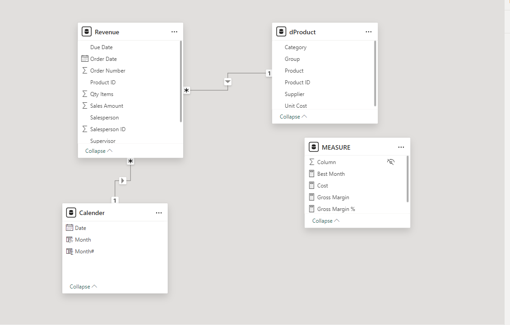
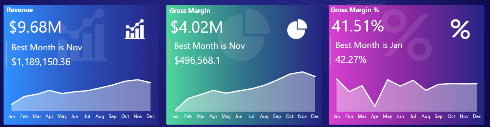
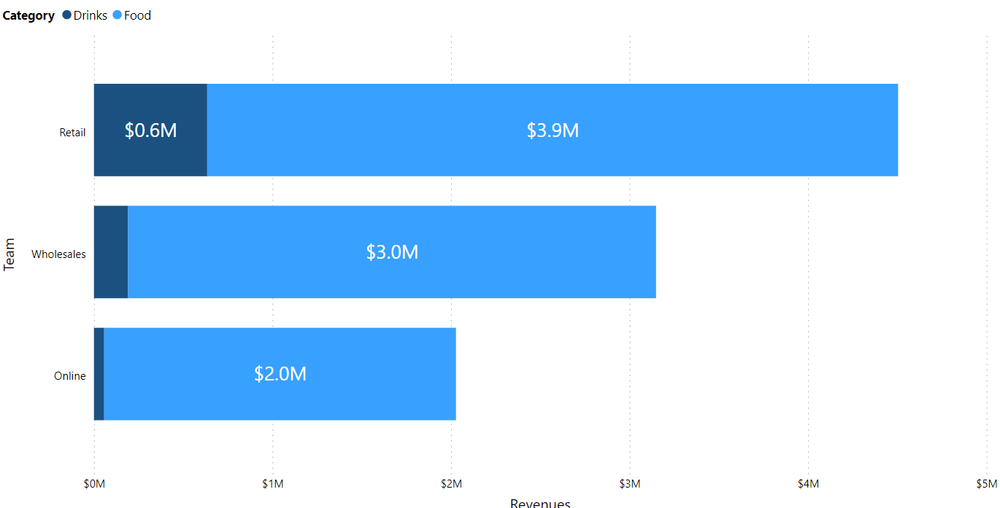
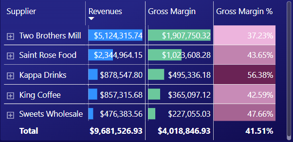
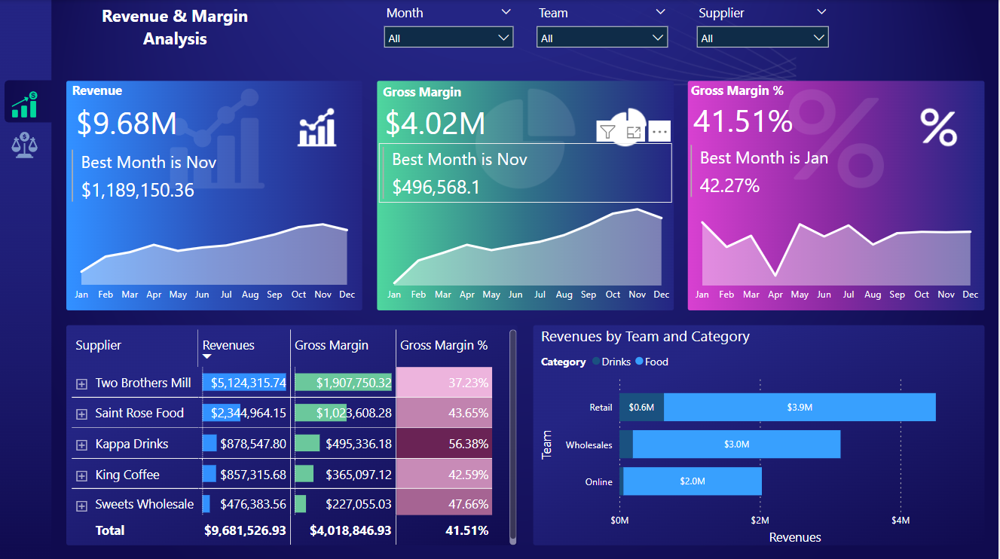

# Revenue Margin Analysis
Appling skills to ivestigate revenue and margin.

## Implemntaion Steps
### Step 1: Data Modeling and EDA.
Importing your data into Power BI and creating your data model. Once your data is ready, we will start doing some initial exploratory data analysis.

* create a dedicated date table using DAX
  * ``` Calender = CALENDARAUTO() ```
  * ```Month# = MONTH([Date])```
  * ```Month = FORMAT([Date],"mmm")  ```
* Creating Measures
  * ```Best Month = "Best Month is "&SELECTEDVALUE('Calender'[Month])```
  * ```Cost = SUMX(Revenue, RELATED(dProduct[Unit Cost])*Revenue[Qty Items]) ```
  * ```Gross Margin = [Revenues]-[Cost] ```
  * ```Gross Margin % = DIVIDE([Gross Margin],[Revenues]) ```
  * ``` Revenues = SUM(Revenue[Sales Amount])```





### Step 2: Investigating Revenues by Team and Category



### Step 3: Creating Table to Monitor Revenue and Margin by Supplier and Groups.




# Final Dashboard Layout




  


